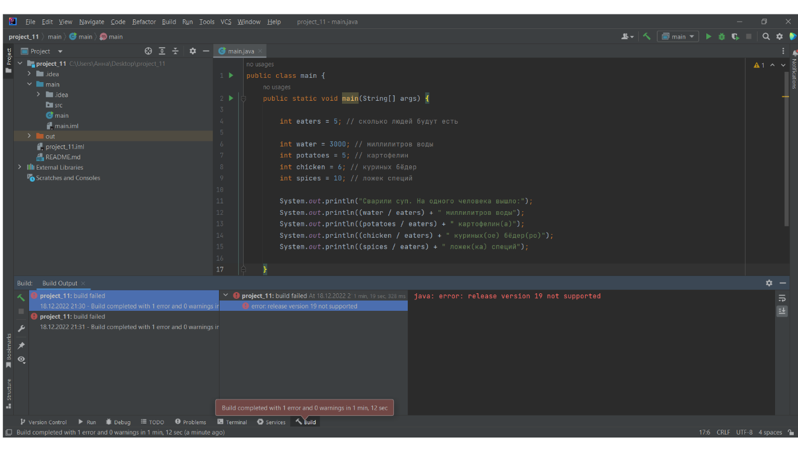

 # Описание
 Расчет ингридиентов блюда на одну порцию
 
 # Локация деффекта
  [ссылка]([main/main.java](https://github.com/NovoselovaAnna/project_11/blob/main/main/main.java))

  # Шаги воспроизведения

  1. Открыть код программы [код программы](https://github.com/NovoselovaAnna/project_11/blob/main/main/main.java) в IDEA
  2. Запустить программу
  3. Проверить вывод консоли

  *Ожидаемый результат:* целое количество ингридиентов блюда на лодну порцию
  *Фактический результат:* сообщение об ошибке 
 # Скриншот
 

 # Окружение
 * **Операционная система:** Windows
 * **IDE:** IntelliJ IDEA 2020.2
 * **Java:** OpenJDK 11